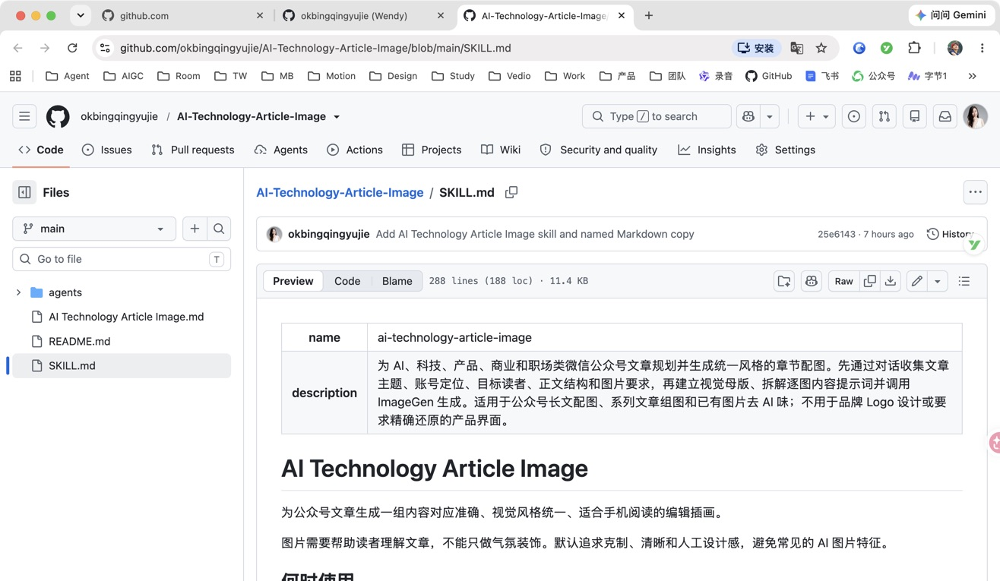
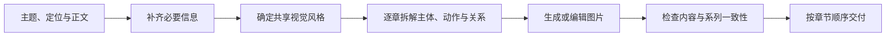

# AI Technology Article Image

### 把一篇科技文章，变成一组风格统一、内容对应的公众号配图

AI Technology Article Image 是一个面向 AI、科技与产品类内容创作者的 Codex Skill。它通过对话了解文章主题、账号定位和读者，再把每个章节的观点转成画面中的主体、动作和关系，调用可用的 ImageGen 能力生成系列插画。

适合公众号作者、AI 产品经理、科技内容编辑，以及希望保持账号视觉风格的个人创作者。

[快速开始](#快速开始) · [功能与作用](#功能与作用) · [截图展示](#截图展示) · [使用示例](#使用示例) · [完整 Skill](SKILL.md)

## 为什么做这个 Skill

给科技文章配图，经常遇到三个问题。图片看起来很“科技”，却没有解释文章；单张不错，放在一起颜色和质感各不相同；换一篇文章，又要重新描述一遍风格。

这个 Skill 把配图过程拆成一套可以复用的工作方式。先想清楚图片要表达什么，再确定如何画，最后检查图片与章节是否匹配。它希望减少重复写提示词的工作，让你把更多精力放在文章本身。

## 功能与作用

| 能力 | 具体做什么 | 对创作者的价值 |
| --- | --- | --- |
| 对话收集需求 | 了解主题、定位、读者、正文、数量与比例，避免重复询问已有信息 | 减少因需求不清造成的返工 |
| 章节内容拆解 | 为每张图确定主体、动作和信息关系 | 让配图能解释观点，而不只是装饰 |
| 共享风格提示词 | 统一色彩、线条、质感、留白和人物抽象程度 | 提高整篇文章的视觉一致性 |
| 构图选择 | 按内容选用流程、分支、边界、跨设备或前后状态构图 | 避免每张图片都像同一张模板 |
| 生成与编辑 | 调用 ImageGen 生成新图，或根据原图调整视觉风格 | 将提示词规划接到实际图片产出 |
| 降低常见 AI 图特征 | 减少塑料人物、霓虹、伪文字、悬浮卡片和无关装饰 | 让画面更克制，适合专业内容 |
| 按章节交付 | 按文章顺序提供图片及对应关系 | 方便后续排版和复用 |

上述价值是设计目标，实际效果取决于文章信息、参考图和图片生成能力；本项目没有宣称未经测量的效率提升比例。

## 默认视觉风格

默认采用科技媒体编辑插画风格，以扁平 2D 为主，搭配少量空间层次。细线、轻微纸张颗粒、非对称构图和较多留白共同构成画面；每张图只保留一个主要视觉中心。

颜色以深海军蓝、钴蓝、低饱和青色、柔和淡紫和暖白为主，少量珊瑚橙用于强调重点。默认不放可读文字和 Logo，界面以抽象线条和几何形状表达。

同一组图共享视觉规则，但会改变主体位置、信息流方向和构图方式。你也可以提供喜欢的参考图，让 Skill 根据可观察的风格特征调整方案。

## 截图展示



*上图为仓库中 Skill 文档的实际页面截图，展示入口文件、功能简介与配图原则。它不是生成图片的效果样张。*

## 快速开始

### 1. 安装到 Codex

可以直接在 Codex 中发送下面这段话。

```text
请使用 skill-installer，将这个仓库根目录中的 Skill 安装到我的 Codex：
https://github.com/okbingqingyujie/AI-Technology-Article-Image
安装名称使用 ai-technology-article-image。
```

安装完成后，在下一条消息中使用 `$ai-technology-article-image` 调用。界面显示名称为 **AI Technology Article Image**。

### 2. 提供文章与需求

```text
用 $ai-technology-article-image 给我的公众号文章生成配图。

主题：RAG 在企业中的应用
账号定位：面向 AI 产品经理的实用技术科普
读者：理解基本 AI 概念，但不熟悉 RAG 实现
图片要求：每个章节 1 张，共 5 张；横版；放在章节末尾
风格要求：克制的编辑插画，蓝色为主，不要机器人和文字
文章正文：
【在这里粘贴正文或完整大纲】
```

不必先准备一份完整设计需求。你可以先发主题和文章，Skill 会补问影响结果的缺失信息。

### 3. 获取图片并调整

它会根据章节组织图片方案，再使用可用的 ImageGen 能力生成图片并逐张检查。你可以针对某一张继续提出修改，例如“第 3 张保留输入到输出的关系，删除人物，减少装饰，其他图片保持不变”。

## 它如何工作



例如，一节文章讲“Agent 把复杂任务分配给不同工具，再汇总结果”，图片就可以用一个协调节点、少量任务分支和一个汇总结果来表达。它优先表现这些工作关系，而不是只根据“Agent”关键词画一个机器人。

## 使用示例

### 为整篇文章制作配图

```text
用 $ai-technology-article-image 为下面这篇 WorkBuddy 文章生成 8 张配图。
面向 AI 产品经理，每个小标题对应一张，图片放在该部分正文之后。
沿用低饱和蓝色、轻微纸张纹理和留白较多的编辑插画风格。
以下是文章全文：
【粘贴文章】
```

### 先规划，再生成

```text
用 $ai-technology-article-image 先规划配图，暂时不要生成。
请列出每个章节的核心观点、主体、动作、构图和内容提示词。
文章主题和大纲如下：
【粘贴主题与大纲】
```

### 调整已有图片的风格

```text
用 $ai-technology-article-image 修改我附上的图片。
保留“手机发起任务、电脑执行、结果返回”的关系。
减少蓝紫霓虹、悬浮卡片和塑料质感，删除伪文字，增加留白。
```

编辑时需要提供原图或可访问的文件。缺失原图时，只能依据已有描述重绘，并应明确说明。

### 沿用参考图

```text
用 $ai-technology-article-image 给新文章配 6 张图。
请参考我附上的图片，沿用颜色、线条和质感，每张图采用不同构图。
文章和章节如下：
【粘贴文章】
```

## 提供哪些信息，图片更容易贴合文章

| 输入 | 建议写法 |
| --- | --- |
| 主题与观点 | 不只写“AI 记忆”，再补一句“长期偏好和临时状态应该分开保存” |
| 读者与定位 | 如“给 AI 产品经理看的技术科普”，或“面向普通职场人的工具教程” |
| 正文或大纲 | 尽量提供每节的具体论点；只有标题时，画面容易泛化 |
| 数量与位置 | 如“5 张，分别放在第 1 至第 5 节末尾” |
| 比例与用途 | 如“公众号正文横图，优先适合手机阅读”；封面需要另行说明 |
| 参考与限制 | 提供喜欢的图片，并说明不要出现的人物、文字或装饰 |

## 你会得到什么

默认交付与章节对应的一组图片，以及清楚的顺序和对应关系。需要时，也可以要求输出图片清单、逐图内容提示词、Markdown 图片引用，或为某几张图片继续修改。

写入飞书文档等外部平台，需要当前环境具备相应连接和权限，并由你提出写入要求。图片生成、文档写入和公众号发布是不同操作，本 Skill 本身不自动发布文章。

## 文件说明

```text
AI-Technology-Article-Image/
├── README.md                         # 项目介绍与使用说明
├── SKILL.md                          # Codex 读取的 Skill 入口
├── AI Technology Article Image.md    # 同内容的具名阅读副本
├── agents/
│   └── openai.yaml                   # 显示名称与默认调用提示
└── docs/
    └── images/
        └── skill-page.jpg           # 文档页面截图
```

`SKILL.md` 与具名 Markdown 文件包含相同的 Skill 内容。安装时需要保留 `SKILL.md` 这个入口文件名；调用名称为 `ai-technology-article-image`。后续修改指令时，应同步更新阅读副本。

## 使用条件与边界

- 需要支持 Skill 的 Codex 环境；实际出图还需要可用的 ImageGen 能力。本仓库不提供独立图片模型或图像生成服务。
- Skill 提供工作步骤、风格约束和提示词模板；结果仍需检查，无法保证每一张图一次生成就完全正确。
- “去 AI 味”指减少特定视觉特征，不代表将生成图片变成人工手绘，也不承诺通过任何来源检测。
- 默认面向正文插画，不适合要求像素级还原的产品界面、精确品牌 Logo 或密集中文信息图。
- 新对话不应依赖未经确认的长期记忆。想稳定复用某种视觉风格，建议保留并重新提供参考图。
- 使用前请确认正文和参考素材适合交给当前使用的服务处理；生成结果仍需遵守素材授权和发布平台要求。

## 反馈与改进

欢迎通过 [Issues](https://github.com/okbingqingyujie/AI-Technology-Article-Image/issues) 提交需求或问题。反馈时可以提供文章类型、调用方式、预期效果及实际结果，帮助定位内容拆解或视觉风格的问题。

让每一张配图，都能为文章多解释一点。
